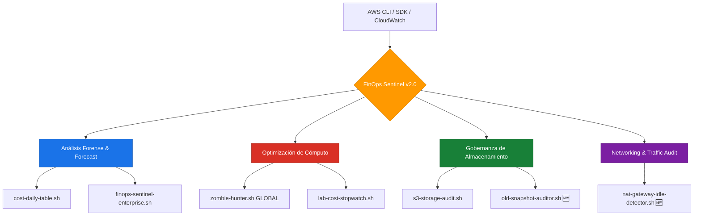

# 🛡️ AWS FinOps Sentinel Toolkit v2.0


**FinOps Sentinel** es una suite profesional de herramientas de automatización diseñadas para la observabilidad financiera, auditoría forense de costos y gobernanza de recursos en Amazon Web Services (AWS).

Esta versión 2.0 evoluciona de la detección pasiva a la **Gobernanza Proactiva**, integrando análisis de tráfico de red y cumplimiento de retención de datos.

---

## 📋 Tabla de Contenidos

- [Propósito](#-propósito)
- [Arquitectura de la Suite](#-arquitectura-de-la-suite-v20)
- [Scripts Incorporados (Arsenal Sentinel)](#-scripts-incorporados-arsenal-sentinel)
- [Instalación y Configuración](#-instalación-y-configuración)
- [Seguridad, Idempotencia y Cumplimiento](#-seguridad-idempotencia-y-cumplimiento)
- [Contribuciones y Comunidad](#-contribuciones-y-comunidad)
- [Roadmap v2.x](#-roadmap-v2x)

---

## 🎯 Propósito

Este repositorio centraliza la lógica de control de gasto para mitigar el **"Cloud Waste"**. Está diseñado para arquitectos y SREs que operan en entornos locales (WSL/Linux) o mediante pipelines de CI/CD, permitiendo una toma de decisiones basada en datos reales de consumo y utilización de infraestructura.

---

## 🏗️ Arquitectura de la Suite v2.0



---

## 🚀 Scripts Incorporados (Arsenal Sentinel)

### 1. 📊 Gestión de Costos y Reportes Ejecutivos

#### `cost-daily-table.sh`
Genera una matriz comparativa del gasto diario del mes actual, destacando desviaciones presupuestarias.

#### `finops-sentinel-enterprise.sh`
Reporte de alta visibilidad que incluye:
- Top 5 de servicios por costo
- Desglose por `UsageTypes`
- Proyección de factura al cierre de mes (**Forecast**)

---

### 2. 🧟 Detección de Recursos Huérfanos (Zombie Hunter)

#### `zombie-hunter.sh`

| Atributo | Detalle |
| :--- | :--- |
| **Alcance** | Global (Multi-región automático) |
| **Detección** | Volúmenes EBS en estado `available` e IPs Elásticas `unassociated` |
| **Impacto** | Eliminación inmediata de costos por recursos sin uso que "desangran" la cuenta |

---

### 3. 🌐 Networking & Traffic Efficiency *(Nuevo v2.0)*

#### `nat-gateway-idle-detector.sh`

| Atributo | Detalle |
| :--- | :--- |
| **Lógica** | Consulta métricas de CloudWatch (`BytesOut`) en las últimas 24 horas |
| **Objetivo** | Identificar NAT Gateways activos en VPCs con tráfico nulo o residual |
| **Valor** | Evita el cargo fijo por hora en entornos de desarrollo o pruebas inactivos |

---

### 4. 🗄️ Gobernanza de Almacenamiento y Cumplimiento

#### `s3-storage-audit.sh`
Analiza versionamiento y **Lifecycle Policies** para prevenir el crecimiento exponencial de costos en buckets S3.

#### `old-snapshot-auditor.sh` *(Nuevo v2.0)*

| Atributo | Detalle |
| :--- | :--- |
| **Lógica** | Filtra snapshots de EBS con antigüedad > 90 días |
| **Filtro de Exclusión** | Omite recursos con la etiqueta `Retention: Legal` |
| **Impacto** | Asegura que solo se mantenga la data necesaria por cumplimiento normativo |

---

### 5. 🧪 Herramientas de Laboratorio

#### `lab-cost-stopwatch.sh`
Herramienta de precisión para estimar el **costo por segundo** durante pruebas de estrés o despliegues efímeros (EKS, Big Data).

---

## 🛠️ Instalación y Configuración

### Requisitos Previos

- **AWS CLI v2** configurado con credenciales válidas.
- **Permisos IAM** de lectura (`ReadOnlyAccess` recomendado).
- **Utilidades de terminal:** `jq` (procesamiento JSON) y `bc` (operaciones matemáticas).

### Configuración Local

```bash
# Clonar el repositorio
git clone https://github.com/jgaragorry/aws-finops-sentinel.git
cd aws-finops-sentinel

# Asegurar permisos de ejecución para la suite
chmod 750 scripts/*.sh
```

---

## 🛡️ Seguridad, Idempotencia y Cumplimiento

Todas las herramientas de esta suite han sido desarrolladas bajo principios de **Ingeniería de Confiabilidad**:

**Modo Read-Only (Auditoría Pura):** Ningún script posee permisos de escritura (`Delete`, `Terminate`, `Modify`). Su función es puramente informativa y analítica.

**Idempotencia:** Las ejecuciones concurrentes no alteran el estado de los recursos de AWS ni generan duplicidad de reportes en la infraestructura.

**Filtrado de Sensibilidad:** El proyecto incluye un `.gitignore` robusto para evitar la fuga accidental de reportes generados localmente o llaves de acceso.

---

## 🤝 Contribuciones y Comunidad

Este es un proyecto abierto para la comunidad de **Cloud Governance**. Si tienes una lógica de ahorro que pueda beneficiar a otros, los Pull Requests son bienvenidos.

> **Maintained by:** José Julio Garagorry Arias
> Senior Cloud Architect & Advisor (Azure/AWS) | SRE & DevSecOps | FinOps Strategy

---

## 🗺️ Roadmap v2.x

- [ ] Integración con **Slack/Teams** para alertas de anomalías.
- [ ] Soporte para análisis de instancias EC2 con bajo uso de CPU (**Right-sizing**).
- [ ] Exportación de reportes en formato **CSV/JSON** para Dashboards externos.
