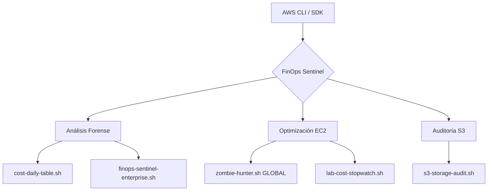

# 🛡️ AWS FinOps Sentinel


**FinOps Sentinel** es una suite de herramientas avanzadas de automatización diseñadas para la observabilidad financiera, auditoría forense de costos y optimización de recursos en entornos Amazon Web Services.

---

## 📋 Tabla de Contenidos
- [Propósito](#-propósito)
- [Arquitectura de la Suite](#-arquitectura-de-la-suite)
- [Scripts Incorporados](#-scripts-incorporados)
- [Instalación y Configuración](#-instalación-y-configuración)
- [Seguridad e Idempotencia](#-seguridad-e-idempotencia)

---

## 🎯 Propósito

Este repositorio centraliza la lógica de control de gasto para evitar el "Cloud Waste". Está diseñado para ser ejecutado en entornos locales (WSL/Linux) con acceso programático a AWS, permitiendo a los administradores de sistemas tomar decisiones basadas en datos en tiempo real.

---

## 🏗️ Arquitectura de la Suite


---

## 🚀 Scripts Incorporados

### 1. Gestión de Costos y Reportes
* `cost-daily-table.sh`: Genera una tabla comparativa del gasto diario del mes en curso con alertas visuales de consumo.
* `finops-sentinel-enterprise.sh`: Reporte de nivel ejecutivo que incluye Top 5 de servicios, tipos de uso y forecast proyectado al cierre de mes.

### 2. Detección de Recursos Huérfanos (Zombies)
* `zombie-hunter.sh`:
   * Alcance: Global (escanea todas las regiones activas automáticamente).
   * Detección: Volúmenes EBS `available` y Elastic IPs `unassociated`.
   * Impacto: Reducción inmediata de costos fijos por hora.

### 3. Auditoría de Almacenamiento
* `s3-storage-audit.sh`:
   * Analiza el estado del versionamiento y la presencia de Lifecycle Policies.
   * Identifica buckets en riesgo de crecimiento de costos descontrolado e informa si la cuenta no posee buckets.

### 4. Herramientas de Laboratorio
* `lab-cost-stopwatch.sh`: Cronómetro de precisión que estima el gasto por segundo durante despliegues de prueba (EKS, n8n, etc.).

---

## 🛠️ Instalación y Configuración

### Requisitos Previos
* AWS CLI v2 instalado y configurado (`aws configure`).
* Permisos de lectura en IAM (`ReadOnlyAccess` o similar).

### Configuración Local
```bash
# Clonar el repositorio
git clone git@github.com:jgaragorry/aws-finops-sentinel.git
cd aws-finops-sentinel

# Asegurar permisos de ejecución
chmod 750 scripts/*.sh
```

---

## 🛡️ Seguridad e Idempotencia

Todas las herramientas integradas en este repositorio siguen estrictos estándares de ingeniería de confiabilidad:

1. **Modo Read-Only**: Ningún script tiene permisos de escritura. No borran ni modifican recursos; solo auditan y reportan.
2. **Idempotencia**: La ejecución repetida de los scripts no altera el estado de la infraestructura ni genera efectos secundarios.
3. **Seguridad de Credenciales**: El archivo `.gitignore` está configurado para evitar la subida accidental de llaves PEM, archivos de credenciales o reportes sensibles.

---

## 🤝 Contribuciones

Si deseas proponer mejoras, por favor abre un Issue o envía un Pull Request.

**Maintained by:** Jose Garagorry - Cloud System Administrator.
